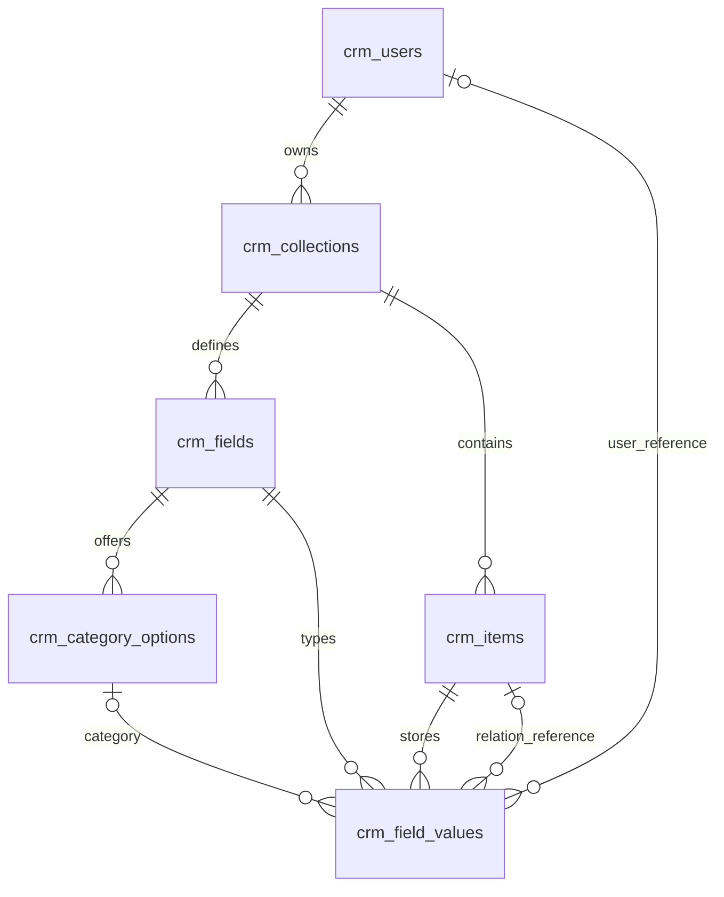

# CRM database design

The screenshots' User, Collection, Field, Item, category option, relation metadata, and typed value concepts are preserved. The implementation uses plural `crm_` table names and makes these adjustments:

- `google_sub` identifies a linked Google account; provisioned accounts begin with null and claim their verified email once.
- `profile` is JSONB; `role` defaults to USER. User emails are normalized to lowercase and unique.
- Collections and items include creation/update timestamps.
- The relation target lives directly on the field as `relation_collection_id`. The screenshot's relationship reference did not identify its originating field.
- Field values use one table with seven typed columns rather than one parent table plus seven subtype tables. A check constraint requires exactly one value column, matching the field type. No JSON blob is used for typed values.
- `user_id` on fields and `collection_id` on values are intentional redundancy. Composite foreign keys enforce tenant ownership and field/item consistency.

## Integrity and transactions

`crm_field_values` has a unique `(item_id, field_id)` constraint, one scalar value per field. Its composite foreign keys ensure an item and its field belong to the same collection, and the stored type matches the definition. Category values must reference an option belonging to that field. Relation values must reference an item in the field's configured target collection. Relation target collections must belong to the same account as the field.

Category option names and field names are unique within their parent. A partial unique index allows at most one default category option per field. A trigger permits category options only for CATEGORY definitions, and another prevents changes to field identity, type, owner, collection, or relation target.

Creation and updates of collections with fields, and items with values, run in a single Neon transaction. Collection mutations lock the collection row so field/value changes serialize. Foreign keys are the final authority if another request removes a resource after validation. Relation and USER reference constraints are deferred until commit to allow cascading deletion of an entire account's internal graph. Remaining references cause a conflict and rollback.

Owner/collection and per-type value indexes support scoped lists and filters. TEXT uses a field-ID index instead of indexing entire text values to avoid Postgres B-tree key limits on large strings. Literal substring searches use `strpos`; values are always bound SQL parameters.

## Applying the schema

`schema.sql` is the authoritative bootstrap schema. `npm run db:migrate` splits it at explicit SQL-comment separators so PL/pgSQL function bodies remain intact, and executes every statement atomically through the Neon driver. The schema can be reapplied. Future changes to existing column definitions should use explicit, versioned ALTER migrations; `CREATE TABLE IF NOT EXISTS` does not evolve existing tables.

The legacy dummy `api_items` table is left untouched to avoid deleting existing data during upgrade. It is no longer part of the API and can be archived or removed manually after any needed backup.

`npm run db:seed` runs its own transaction, locks user-role provisioning, inserts an explicitly configured administrator, and adds an ordinary demo user with sample Companies and Contacts. Fixed sample IDs and conflict handling make reruns idempotent. It does not reset existing items or demote other admins; an existing different admin causes a refusal. Do not use the sample IDs for application-generated resources.
